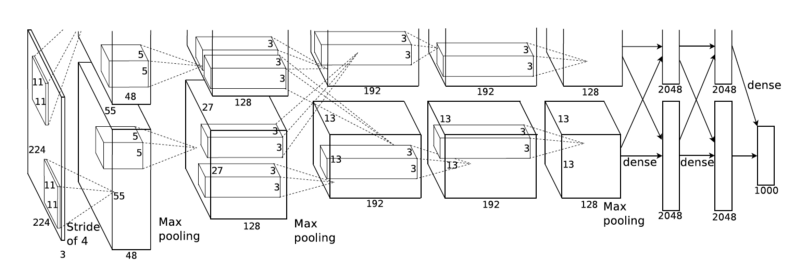
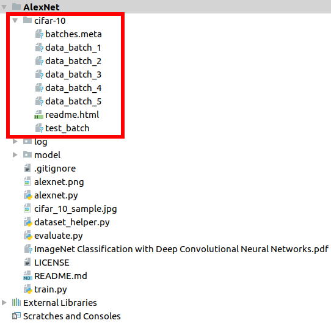

In the name of God

# AlexNet
This repository contains implementation of [AlexNet](https://papers.nips.cc/paper/4824-imagenet-classification-with-deep-convolutional-neural-networks.pdf)
(ImageNet Classification with Deep Convolutional Neural Networks) by Tensorflow and the network tested with the
[CIFAR-10 dataset](https://www.cs.toronto.edu/~kriz/cifar.html).



# Download the CIFAR-10 dataset
Before train and evaluate the network, you should download the following dataset:

* CIFAR-10 Dataset: https://www.cs.toronto.edu/~kriz/cifar-10-python.tar.gz

Extract the `cifar-10-python.tar.gz` file, then your folder structure should be like the following image:



# Training CIFAR-10 dataset
To train the network with cifar-10 dataset, type the following command at the command prompt:
```
python3 ./train.py
```

Sample images from cifar-10 dataset:


## Results

### Epoch 0
```
Train Accuracy = 0.100
Test Accuracy = 0.100
```

### Epoch 1
```
Train Accuracy = 0.305
Test Accuracy = 0.303
```

### Epoch 2
```
Train Accuracy = 0.408
Test Accuracy = 0.402
```

...

### Epoch 50
```
Train Accuracy = 0.986
Test Accuracy = 0.721
```

...

### Epoch 100
```
Final Train Accuracy = 1.000
Final Test Accuracy = 0.739
```

# Evaluating CIFAR-10 dataset
To evaluate the network with cifar-10 dataset, type the following command at the command prompt:
```
python3 ./evaluate.py
```
# Dependencies
* Python 3
* numpy
* scipy
* pillow
* tensorflow

# Links
* https://papers.nips.cc/paper/4824-imagenet-classification-with-deep-convolutional-neural-networks.pdf
* https://www.cs.toronto.edu/~kriz/cifar.html
* https://github.com/amir-saniyan/AlexNet
